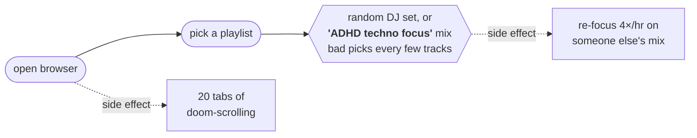
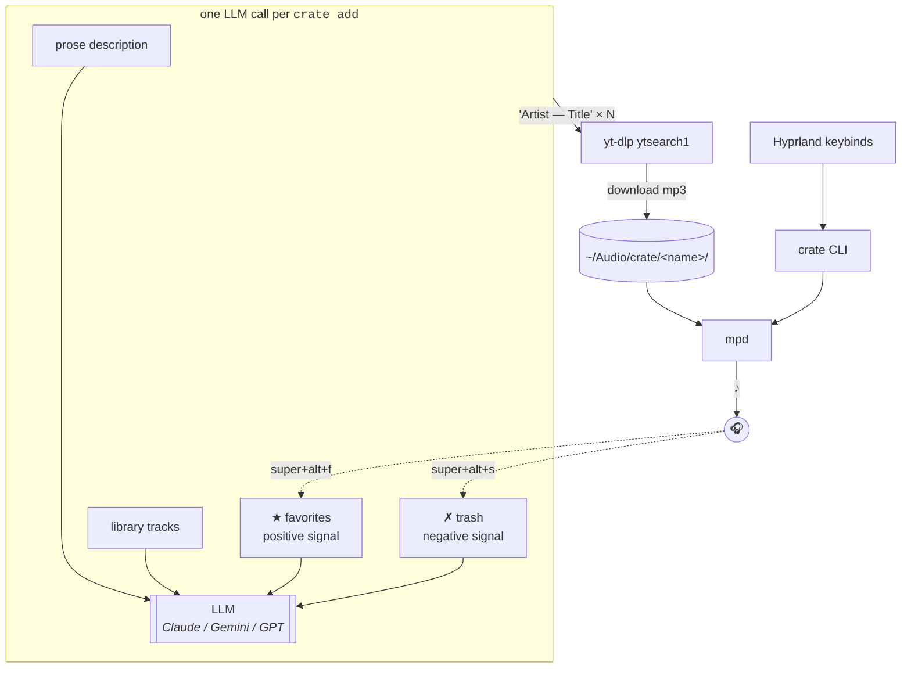

<div align="center">

```
                _       
               | |      
  ___ _ __ __ _| |_ ___ 
 / __| '__/ _` | __/ _ \
| (__| | | (_| | ||  __/
 \___|_|  \__,_|\__\___|

      personal audio crates
       curated by an LLM
```

**describe a vibe → llm picks tracks → yt-dlp downloads → mpd plays → skip what sucks**

[install](#install) · [usage](#usage) · [architecture](#architecture) · [faq](docs/FAQ.md)

</div>

---

## what is this

```
            ┌──────────────────────────────────┐
            │   ░░░ ░░░ ░░░ ░░░ ░░░ ░░░ ░░░    │ ← a crate
            │   ░░░ ░░░ ░░░ ░░░ ░░░ ░░░ ░░░    │   (a folder of audio
            │   ░░░ ░░░ ░░░ ░░░ ░░░ ░░░ ░░░    │    you've curated for
            │   ░░░ ░░░ ░░░ ░░░ ░░░ ░░░ ░░░    │    one purpose)
            └──────────────────────────────────┘
              focus     casual     workout     podcasts
```

A `crate` is a folder of audio (at `~/Audio/crate/<name>/`) you describe in plain English. An LLM suggests tracks. `yt-dlp` downloads them. `mpd` plays them. Skip a bad track and it goes to `.trash/` so it never comes back. Mark a great one with `fav` and the LLM biases future suggestions toward it.

The folder *is* the state — `~/Audio/crate/<name>/` holds the audio, the description, the favorites list, and the trash. The LLM *is* the curator. The user *is* the filter. No database. No audio-feature ML pipeline. No browser. No platform lock-in. ~450 lines of Python.

## why

Switching to a browser to play YouTube Music is a focus-killer:



Even the "focus" playlists — algorithmically named, generically curated — sneak in vocals, wild BPM jumps, and tracks that just don't fit. You either tolerate the breakage or you spend energy gardening someone else's bad taste.

`crate` collapses the whole loop to one keybind. The library is *yours*: you describe the vibe, the LLM sources tracks, you skip what sucks, you ★ what sticks. After 30 tracks the crate sounds like *you*, not like a YouTube algorithm.

## install

**Prereqs**: `python3` (3.11+), `yt-dlp`, `mpd`, `mpc`, plus `walker`/`wofi`/`rofi`/`fzf` (for the switch picker).

```sh
# Arch
sudo pacman -S mpd mpc yt-dlp python fzf

# Debian / Ubuntu
sudo apt install mpd mpc yt-dlp python3 fzf
```

```sh
git clone git@github.com:flaviolivolsi/crate.git
cd crate
make install                                  # → ~/.local/bin/crate

# point mpd at the audio root
cp config/mpd.conf.example ~/.config/mpd/mpd.conf
mkdir -p ~/.local/share/mpd/playlists
systemctl --user enable --now mpd

# wire up keybinds (Hyprland example)
cp config/hyprland.bindings.example ~/.config/crate/hyprland.bindings
echo "source = ~/.config/crate/hyprland.bindings" >> ~/.config/hypr/bindings.conf
hyprctl reload
```

Set an LLM API key in your shell (auto-detected in this priority order):

```sh
export ANTHROPIC_API_KEY=sk-ant-...    # Claude — recommended for taste
export GEMINI_API_KEY=...              # Gemini — cheap and fast
export OPENAI_API_KEY=sk-...           # GPT
```

```sh
crate doctor      # verify everything ✓
crate new focus   # interactive prompt for description
crate add focus   # 20 tracks land in ~/Audio/crate/focus/
crate play focus  # 🎶
```

> **Where do crates live?** `~/Audio/crate/<name>/` by default — override via `[paths] root` in `~/.config/crate/crate.toml`. mpd's `music_directory` must match.

## usage

### the verbs

| command | what it does |
|---|---|
| `crate new <name>` | create a new crate (prompts for description) |
| `crate add [<name>] [prose]` | LLM suggests N tracks, yt-dlp downloads them |
| `crate play [<name>]` | play crate (defaults to active) |
| `crate skip` | move current track to `.trash/` and advance — **negative** signal |
| `crate fav` | mark current track as favorite — **positive** signal |
| `crate unfav` | remove from favorites |
| `crate next / prev / pause` | mpc passthrough |
| `crate use <name>` | set active crate |
| `crate switch` | picker → set active + play |
| `crate list` | all crates + sizes (`★ favs`, `# trashed`) |
| `crate now` | current track + crate name |
| `crate doctor` | health check |

### the keybinds (Omarchy-friendly defaults)

```
  ┌──────────────┬─────────────────┐  ┌──────────────┬──────────────┐
  │  super + m   │  play           │  │ super+alt+m  │  pause       │
  │  super + n   │  next           │  │ super+alt+p  │  prev        │
  └──────────────┴─────────────────┘  │ super+alt+s  │  skip        │
                                      │ super+alt+f  │  ★ favorite  │
                                      │ super+alt+c  │  switch      │
                                      └──────────────┴──────────────┘
```

### a typical session

```sh
$ crate new focus -d "deep melodic techno, instrumental, ~122bpm, like Tale of Us"
Created crate 'focus' at ~/Audio/crate/focus
Active crate: focus

$ crate add focus
asking gemini/gemini-2.5-flash for 20 suggestions...
got 20 suggestions, downloading...
  [1/20] ARTBAT — Upperground... ✓
  [2/20] Colyn — Amot... ✓
  [3/20] Mind Against — Walking Away... ✓
  ... (17 more) ...

added 20/20 tracks to focus

$ crate play focus
[playing]

# while listening, on the keyboard:
#   Super+Alt+F  → ★ love this one (LLM will lean toward similar next batch)
#   Super+Alt+S  → skip, never suggest again

$ crate add focus     # later — gets 20 MORE tracks
asking gemini/gemini-2.5-flash for 20 suggestions (biasing toward 4 favorites)...
[no repeats from library or trash, leans toward your favorited style]
```

## architecture



The dotted lines are the feedback loop: every `fav` and `skip` you make becomes context for the next `crate add`, so the library grows toward your taste with no extra effort.

**Why this is the right shape:**

- **One LLM call per discovery cycle.** Cheap (~$0.0002 with Gemini Flash), fast, adaptive (sees library, favorites, trash — won't repeat, biases toward what you love).
- **No ML pipeline.** No CLAP, no Essentia, no audio-feature analysis. The LLM already knows what's instrumental, what sounds like Tale of Us, what's at 122 BPM.
- **Folder = state.** No database, no schema migrations, no corruption modes.
- **User in the loop.** `skip` is the negative signal. `fav` is the positive signal. After ~30 tracks the crate becomes uniquely yours.

## storage layout

```
~/Audio/crate/
├── focus/
│   ├── .crate.json           # {description, created, updated, llm_model}
│   ├── .favorites            # filenames the LLM biases toward (one per line)
│   ├── .trash/               # rejected — kept to prevent re-download
│   └── *.mp3                 # the library
├── casual/
│   └── ...
└── podcasts/
    └── ...
```

## configuration

`~/.config/crate/crate.toml` — see [`config/crate.toml.example`](config/crate.toml.example). All fields optional.

```toml
[paths]
root = "~/Audio/crate"

[llm]
provider = "anthropic"           # or "gemini" / "openai"
model    = "claude-sonnet-4-6"
```

## supported compositors

Bindings examples ship for: **Hyprland**, **Sway**, **i3**, **sxhkd** (X11). The script itself is compositor-agnostic — keybindings are config, not code.

## license

MIT. Use, fork, sell, whatever.

## faq

See [docs/FAQ.md](docs/FAQ.md): ethics of YouTube downloads, API rate limits, why no Spotify, why no audition pipeline, how to extend.

---

<div align="center">

*built with frustration toward YouTube Music tabs.*

</div>
